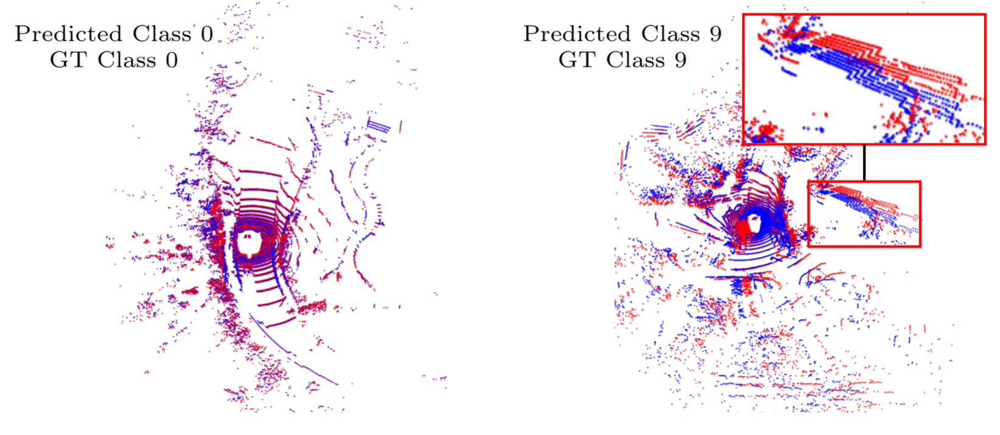
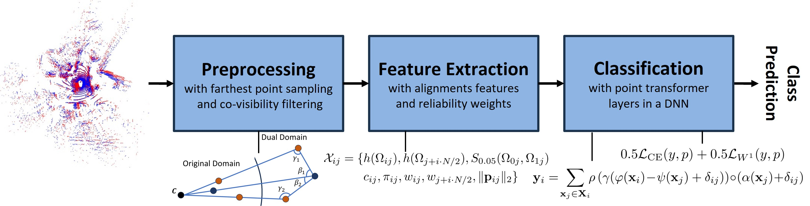
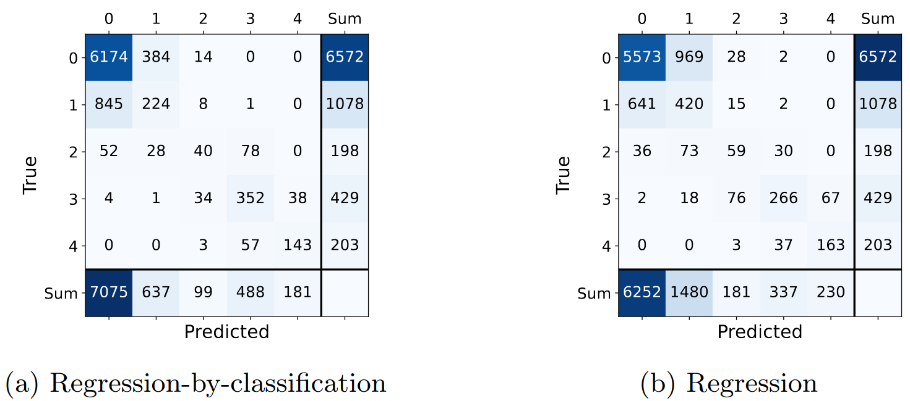
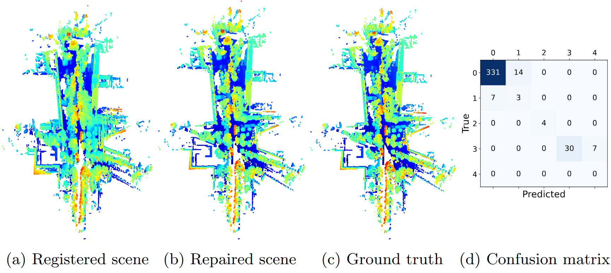

# FACT

## FACT: Multinomial Misalignment Classification for Point Cloud Registration

## Description
This project is the code-base for FACT. Given two point clouds, and an estimated rigid transformation between the point clouds, FACT predicts the registration quality of the alignment.

Link to corresponding paper: [FACT](https://arxiv.org/abs/2504.06627) (published version coming soon)

Point cloud pairs that we try to correct can look something like this. GT class 0 means that the actual error is zero. GT class 9 is the highest error class for this experiment.


The pipeline of FACT looks like this:



## Installation
This project uses [Poetry](https://python-poetry.org/) for dependency management. Follow these steps to set up the environment:

### Code and Dependency Setup
1. **Clone the repository:**

   ```bash
   git clone https://github.com/LudvigDillen/FACT.git
   cd FACT
   ```

2. **Install poetry**
Follow the instructions on Poetry's official installation guide.

3. **Install the project dependencies**

    ```bash
    poetry install
    ```
4. **Activate poetry environment**
   ```bash
   poetry shell
   ```

### Data Setup
To run experiments, you need to download nuScenes and potentially KITTI.

1. **Download nuScenes lidar data**
    1. Go to [nuScenes](https://www.nuscenes.org/nuscenes)
    2. Create an account
    3. Login
    4. Go to nuScenes/Downloads/Full dataset (v1.0) and download Mini and Trainval. For Trainval, it suffices to download the Metadata + Lidar blobs for all parts (i.e. part 1 - part 10) (so 850 scenes in total).
The full download should be 221 GB (I think)

2. **Download KITTI**
    1. Go to [KITTI](https://www.cvlibs.net/datasets/kitti/)
    2. Create an account
    3. Login (once the account is accepted, can take some time)
    4. Follow [Geotransformer](https://github.com/qinzheng93/GeoTransformer?tab=readme-ov-file) for how to download and organize the KITTI data.
The full download (after following steps in GeoTransformer)

## Usage
To run the code there are a few things to know. First off, the all configuration files can be found in `classifiers/PointTransformers/config/`, for different experiments, different configuration files are suitable to use. We'll get back to which one to use for which experiment, and also a bit of what it contains.

To load a specific model, specify the model path after `load_model_path:`

To train with the same data use `re_use_data: True`, to do feature extraction on new data,
set it to false. The `feature_folder` will determine which data that is used. As it is right now,
if `feature_folder` is is the same as earler and `re_use_data: False`, then the data will be overwritten, so **PAY ATTENTION TO THIS**.
To run the code, simply run `python main.py`. It can be good to debug and the I recommend setting `debug: True` in the config file.

To specify which config file to use, change it to the correspond file over the function `fact()` in `classifiers/PointTransformers/train_cls.py`.

### Code Structure
I will say something about the code structure so things can be more easily found.
We could devide the code into 5 parts:
1. Dataset Handling
    - `registration` some tools for registering point clouds that create our datasets.
    - `utils/data_handling` loading of data
    - `utils/nuscenes_handling` loading of nuScenes data
2. Feature Extraction
    - `features/` includes tool for feature extraction both for us and CorAl
    - `utils/pointclouds.py` keeps track of classes of point cloud characteristics and extracted features. 
3. Classification
    - `classifiers/PointTransformers/train_cls.py` is the main classification script.
4. External Code
    - `GeoTransformer_202407` (like [original repo](https://github.com/qinzheng93/GeoTransformer) with some small modifications)
    - `classifiers/PointTransformers` is mostly based on the [code](https://github.com/qq456cvb/Point-Transformers)
5. Other Stuff
    - `classifiers/PointTransformers/config/` configuration files
    - `weights/` including our model weights

Files I don't mention are perhaps not as important. Or I think their purpose is self-explanatory. Or I forgot to mention them.

### Details of the Config File

A caveat: 
- Some of the directories in the config-files are currently set using absolute path. You do need to adjust this to your machine.

Now the config file is a bit involved, so I will mention the most important things to consider

- `features_to_use:` one can do classification on other examples than ones that were extracted.
- `re_use_data:` Set to true if only running training and no feature extraction
- `continue_training:` to continue training from already trained model
- `n_scenes:` to train on. 850 is max for v1.0-trainval
- `one_scene:` use only for reg_mpe when registering a full scene
- `n_samples_per_scene:` samples to extract per scene. The max number I used were 40.
- `data_folder:` where you store your dataset
- `feature_folder:` to where you extract your features. Note that this can be overwritten.
- `visualization_folder:` where some visualization results are outputted. 
- `model_identifier:` a type of id that will be used in naming of automatically generated files.
- `rerun_crash:` if feature extraction crashes, we can re-run it from a specific scene.
- `perturb_settings:`
  - `n_classes: 5` how many output classes to use  
  - `r_bin: 0.01`  only used for "m_classes" setup (so typically not used)
  - `t_bin: 0.1`   only used for "m_classes" setup (so typically not used).
  - `class_distribution: uniform` not use currently
  - `perturbation_method: registration`  m_classes is the fixed_registration (with pre-defined perturbations) and registration is with registration by a registration method. Typically, p2l.
  - `train_reg_max_dist: 5`  The distance between samples nuScenes to register. 1 will be like registering pc0 to pc1, but n will be like registering pc_i to pc_{i+n}, making the training examples more difficult.
- `regression: false` whether to do registration or not.

- `neighborhood:` the min and max size of local neighborhoods to extract features from. The neighborhood size increases with the distance from the sensors as the point cloud becomes more sparse further away.
- `preprocessing:`
  - `T_close: 1.5` removes all point within 1.5 meters from the sensor
  - `apply_hpr_operator: true` whether to use the hidden point operator or not. Will remove some non-covisibile points if set to true.
- `debug:` whether to enter debug mode or not.
- To train a new model, set `load_model_path: False`
- `running_iterations: 1` could doing several runs after one another.

- In wasserstein.py there is a parameter controlling how large neighborhood batch we use. It is hard-coded now, so if something crashed due to memory issues, maybe decrease `COMPUTATION_THRESHOLD`.

### Re-producing Experiments
Where are going to go through how to reproduce the result of the paper and by doing so, also go through how to run the code.

#### Experiment 1:

The model used for FACT is
- `weights/best_model_FACT_best_network_optimal.pth`
- For FACT use `cls_fixed_reg_error.yaml`
- For CorAl, use `cls_coral.yaml`. The model is fast to train.

**Table 1.** Classification accuracy for CorAl and FACT on two classification tasks.
|             **Task**             | **[CorAl](https://ieeexplore.ieee.org/stamp/stamp.jsp?arnumber=9568846)** | **Mapped FACT** |
|:--------------------------------:|:------------------------------:|:---------------:|
| $(\theta, e_d)=(0.01, 0.1)$       | 75.3%                         | **97.4%**      |
| $(\theta, e_d)=(0.03, 0.3)$       | 95.6%                         | **100.0%**     |

#### Experiment 2:
**Setup**

To reproduce the left figure, use weights
- `best_model_average_dist_bins_5_alt1_classes_34000_with_max_train_dist_5_new_val_metric.pth`
- The data is found under `average_dist_bins_5_alt1_classes_34000_with_max_train_dist_5.zip` on OneDrive (ask if you want access).
- Use the config file `cls_adaptive.yaml`.

To reproduce the right figure, use weights
- `best_model_regression_34000samples.pth`
- The data is found under `regression_34000samples.zip` on OneDrive (ask if you want access).
- Use the config file `regression.yaml`.



#### Experiment 3:
This table can easily be calculated from the confusion matrices in experiment 2, just do the math according the caption of table 2.

**Table 2.** Comparison between regression-by-classification (RbC) and regression. $\xi_k$ represents the fraction of samples where the predicted label is at least $k$ classes away from the true label.

|                 | $\xi_1$      | $\xi_2$      | $\xi_3$      | $\xi_4$      |
|-----------------|--------------|--------------|--------------|--------------|
| **RbC**       | **18.24%**   | **0.88%**    | **0.05%**   | **0.00%**   |
| **Regression**| 23.57%       | 1.07%       | **0.05%**   | **0.00%**   |

#### Experiment 4:
To reproduce the results use
- `best_model_geotrans_kitti_remove_centers_5000_normal_feat_extrac_nuscenes_pretrained_short_training.pth` is the weights.
- The data is found under `geotrans_kitti_remove_centers_5000_normal_feat_extrac_nuscenes_pretrained.zip` on OneDrive (ask if you want access).
- Use the config file `cls_registration_geotrans_kitti_good_results.yaml`.

**Table 3.** The confusion matrix for the GeoTransformer registration-based test dataset on KITTI.  
*Classes 0 and 1 have been collapsed into one class.*

|                   | **Pred 0** | **Pred 1** | **Pred 2** | **Pred 3** |
|-------------------|------------|------------|------------|------------|
| **True Class 0**  | 392        | 11         | 0          | 0          |
| **True Class 1**  | 59         | 19         | 3          | 0          |
| **True Class 2**  | 0          | 3          | 5          | 1          |
| **True Class 3**  | 0          | 1          | 4          | 2          |

#### Experiment 5:
**Setup**
- In `main.py` change to `reg_mpe()`.
- Use `cls_registration.yaml` as config.
- Run with `python main.py` and wait approximately 10 mins (on an RTX4090).
For scene 708, FACT gets this result. The idea is to get map (b) to look like map (c) which it largely does here. The color denotes the $z$ coordinate. Figure (d) shows the corresponding confusion matrix.


## Authors and acknowledgment
This project is based on the joint work of Ludvig Dillén, Per-Erik Forssén, and Johan Edstedt. If you find our work useful, please consider citing our paper!
```bash
@InProceedings{dillen25fact,
  author =    {Ludvig Dill\'en and Per-Erik Forss\'en and Johan Edstedt},
  title =     {{FACT}: Multinomial Misalignment Classification for Point Cloud Registration},
  booktitle = {Proceedings of the Scandinavian Conference on Image Analysis (SCIA)},
  year =      {2025},
  month =     {June},
  address =   {Reykjav\'ik, Iceland},
  publisher = {Springer},
  note =      {\url{https://scia2025.org/}},
}
```

## Project status
- Code can be faster, more readable, and documented. I'll try to fix this if I have time in the future.
- I have probably missed a few things here.

**TODO**
- Use PointTransformerV3 for more high-performing classification.
- Learn features to classify instead of hand-crafting them.
